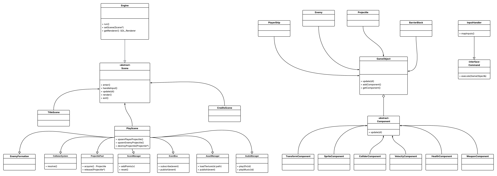

# Space Invaders C++

A 2D Space Invaders-style arcade shooter built in C++ with SDL3, SDL3_image, and miniaudio. The project uses a scene-based structure with a real-time game loop, modular game objects, collision handling, enemy spawning, and level-based difficulty scaling.

Preliminary UML


## Features

- Scene-based game flow with separate title, gameplay, and game-over screens
- Delta-time update loop for frame-rate independent movement
- Real-time keyboard input for player movement and firing
- Reusable object-oriented entities for the player, enemies, and projectiles
- Manual AABB collision detection for player, enemies, and opposing projectiles
- Dynamic difficulty scaling through faster enemies, faster enemy projectiles, and shorter spawn intervals
- HUD display for current level, total kills, and remaining lives
- Sound effects and looping background music using miniaudio

## Controls

- `W A S D`: Move
- `Space`: Shoot / start game
- `R`: Return to title screen after game over

## Architecture

The project is organized around a small engine loop and a scene interface:

- `Engine` owns SDL initialization, the renderer/window lifecycle, keyboard state polling, and the main input-update-render loop.
- `Scene` provides a common interface for `TitleScene`, `PlayScene`, and `CreditScene`.
- `PlayScene` owns the main gameplay state, including the player, active enemies, projectiles, HUD state, collision checks, cleanup, and progression logic.
- `GameObject` is the shared base type for anything that updates, renders, and has a rectangle in the world.
- `Player`, `Enemy`, and `Projectile` specialize movement, rendering, and gameplay behavior.
- `AudioManager` centralizes music and sound-effect loading/playback through miniaudio.

## Gameplay Systems

The implemented gameplay currently includes:

- Player movement constrained to the game window
- Player shooting with a cooldown
- Enemy spawning at randomized horizontal positions
- Enemy autonomous firing with per-enemy shot timers
- Collision checks for:
  - player projectiles vs enemies
  - player projectiles vs enemy projectiles
  - enemy projectiles vs player
  - enemy ships vs player
- Life tracking and hit feedback
- Game-over transition to a restartable end screen
- Level progression based on kill thresholds

Difficulty increases as levels advance by:

- increasing enemy movement speed
- increasing enemy projectile speed
- decreasing enemy spawn cooldown to a minimum floor

## Build

This repository vendors `SDL` and `SDL_image`, so no separate package installation is required for those libraries.

### Configure

```bash
cmake -S . -B build
```

### Build

```bash
cmake --build build
```

### Run

```bash
./build/spaceinvaders
```

If your generator places the binary in a configuration folder, use:

```bash
./build/Debug/spaceinvaders
```

## Project Structure

```text
.
├── main.cpp
├── Engine.*
├── Scene.hpp
├── TitleScene.*
├── PlayScene.*
├── CreditScene.*
├── GameObject.*
├── Player.*
├── Enemy.*
├── Projectile.*
├── AudioManager.*
├── assets/
├── SDL/
└── SDL_image/
```

## Notes

- The game code is separate from the vendored third-party library source in `SDL/` and `SDL_image/`.
- The current implementation is intentionally straightforward and focuses on clarity over advanced engine abstractions.
